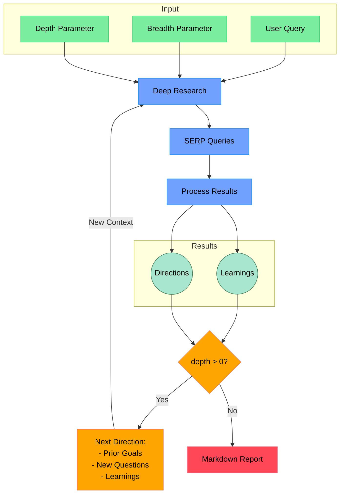

# Deep Research MCP Server

[](https://github.com/PaoloC68/deep-research-mcp-server/actions/workflows/ci.yml)
[](https://nodejs.org/)
[](https://www.typescriptlang.org/)
[](https://makersuite.google.com/app/apikey)
[](https://ai.google.dev/gemini-api/docs/deep-research)
[](https://github.com/modelcontextprotocol)
[](https://opensource.org/licenses/MIT)

**Your AI-Powered Research Assistant.** Uses Google's official **Deep Research Agent** (`deep-research-pro-preview-12-2025`) via the Interactions API for autonomous, multi-step research with professional reports and citations.

---

## Table of Contents

* [Features](#features)
* [Why This Project](#why-this-project)
* [Workflow Diagram](#workflow-diagram)
* [Persona Agents](#persona-agents)
* [How It Works](#how-it-works)
* [Project Structure](#project-structure)
* [Requirements](#requirements)
* [Setup](#setup)
* [Usage](#usage)
  * [As MCP Tool](#as-mcp-tool)
  * [Standalone CLI Usage](#standalone-cli-usage)
  * [MCP Inspector Testing](#mcp-inspector-testing)
* [Configuration](#configuration)
* [Quickstart](#quickstart)
* [Example Output](#example-output)
* [Support](#support)
* [Contributing](#contributing)
* [Roadmap](#roadmap)
* [License](#license)

The goal of this project is to provide the *simplest* yet *most effective* implementation of a deep research agent.  It's designed to be easily understood, modified, and extended, aiming for a codebase under 500 lines of code (LoC).

**Key Features:**

* **MCP Integration:** Runs as a Model Context Protocol (MCP) server/tool for seamless agent integration.
* **Gemini 2.5 Flash Pipeline:** Long-context reasoning, structured JSON outputs, and tool use (Google Search Grounding, Code Execution, Functions) via env flags.
* **Iterative Deep Dive:** Query refinement + result analysis with learned context carried forward.
* **Depth & Breadth Control:** Tune exploration scope precisely.
* **Semantic/Recursive Splitting:** Token-aware chunking for robust summarization and analysis.
* **Batching + Caching:** Concurrency-limited batched model calls with LRU caches across prompts/results.
* **Professional Reports:** Generates structured Markdown (Abstract, ToC, Intro, Body, Methodology, Limitations, Key Learnings, References).

## Why This Project

* **Gemini-first, modern pipeline:** Built around Gemini 2.5 Flash with optional tools (Search Grounding, Code Execution, Functions).
* **Minimal, understandable core:** Plain TypeScript; easy to audit and extend.
* **Deterministic outputs:** Zod-validated JSON and consistent report scaffolding.
* **Agent-ready:** Clean MCP server entry; works with Inspector and MCP-aware clients.

## Workflow Diagram



## Persona Agents

**What are Persona Agents?**

In `deep-research`, we utilize the concept of "persona agents" to guide the behavior of the Gemini language models.  Instead of simply prompting the LLM with a task, we imbue it with a specific **role, skills, personality, communication style, and values.** This approach helps to:

* **Focus the LLM's Output:** By defining a clear persona, we encourage the LLM to generate responses that are aligned with the desired expertise and perspective.
* **Improve Consistency:** Personas help maintain a consistent tone and style throughout the research process.
* **Enhance Task-Specific Performance:**  Tailoring the persona to the specific task (e.g., query generation, learning extraction, feedback) optimizes the LLM's output for that stage of the research.

**Examples of Personas in use:**

* **Expert Research Strategist & Query Generator:**  Used for generating search queries, this persona emphasizes strategic thinking, comprehensive coverage, and precision in query formulation.
* **Expert Research Assistant & Insight Extractor:**  When processing web page content, this persona focuses on meticulous analysis, factual accuracy, and extracting key learnings relevant to the research query.
* **Expert Research Query Refiner & Strategic Advisor:**  For generating follow-up questions, this persona embodies strategic thinking, user intent understanding, and the ability to guide users towards clearer and more effective research questions.
* **Professional Doctorate Level Researcher (System Prompt):**  This overarching persona, applied to the main system prompt, sets the tone for the entire research process, emphasizing expert-level analysis, logical structure, and in-depth investigation.

By leveraging persona agents, `deep-research` aims to achieve more targeted, consistent, and high-quality research outcomes from the Gemini language models.

## How It Works

Core modules:

* `src/deep-research.ts` — orchestrates queries, batching, analysis, and synthesis
  * `generateSerpQueries()` uses Gemini to propose SERP-style queries from your prompt and prior learnings
  * `processSerpResult()` splits content, batches Gemini calls with tools enabled, extracts learnings and citations
  * `conductResearch()` runs analysis passes over semantic chunks
  * `writeFinalReport()` builds the final professional Markdown report
* `src/ai/providers.ts` — GoogleGenAI wrapper for Gemini 2.5 Flash, batching, token control, optional tools
* `src/ai/text-splitter.ts` — RecursiveCharacter and Semantic splitters
* `src/mcp-server.ts` — MCP server entry point and types
* `src/run.ts` — CLI entry point

Pipeline highlights:

* Structured JSON outputs validated with Zod
* Concurrency-limited batching (`generateBatch`, `generateBatchWithTools`)
* LRU caches for prompts, SERP proposals, and reports
* Optional Gemini tools via flags: Google Search Grounding, Code Execution, Functions

## Project Structure

```text
deep-research-mcp-server/
├─ src/
│  ├─ ai/
│  │  ├─ providers.ts           # Gemini wrapper, tools, batching, caching
│  │  └─ text-splitter.ts       # Semantic/recursive splitters
│  ├─ mcp-server.ts             # MCP server entry/types
│  ├─ deep-research.ts          # Orchestrator: queries → analysis → synthesis
│  ├─ prompt.ts                 # System + templates
│  ├─ feedback.ts               # Refinement/feedback loop
│  ├─ output-manager.ts         # Report/output formatting
│  ├─ progress-manager.ts       # CLI progress
│  ├─ terminal-utils.ts         # CLI helpers
│  ├─ types.ts                  # Zod schemas/types
│  └─ utils/                    # JSON/sanitize helpers
├─ dist/                        # Build output
├─ .env.example                 # Environment template
├─ package.json                 # Scripts/deps
└─ README.md
```

## Requirements

* [Node.js](https://nodejs.org/) v22.x
* [Google Gemini API key](https://makersuite.google.com/app/apikey)

## Setup

### Node.js

1. **Clone the repository:**

    ```bash
    git clone [your-repo-link-here]
    ```

2. **Install dependencies:**

    ```bash
    npm install
    ```

3. **Set up environment variables:** Create a `.env.local` file in the project root:

    ```bash
    # Required
    GEMINI_API_KEY="your_gemini_key"

    # Recommended defaults
    GEMINI_MODEL=gemini-2.5-flash
    GEMINI_MAX_OUTPUT_TOKENS=65536
    CONCURRENCY_LIMIT=5

    # Gemini tools (enable as needed)
    ENABLE_GEMINI_GOOGLE_SEARCH=true
    ENABLE_GEMINI_CODE_EXECUTION=false
    ENABLE_GEMINI_FUNCTIONS=false
    ```

4. **Build the project:**

    ```bash
    npm run build
    ```

## Usage

### As MCP Tool

To run `deep-research` as an MCP tool, start the MCP server:

```bash
node --env-file .env.local dist/mcp-server.js
```

You can then invoke the `deep-research` tool from any MCP-compatible agent using the following parameters:

* `query` (string, required): The research query.
* `depth` (number, optional, 1-5): Research depth (default: moderate).
* `breadth` (number, optional, 1-5): Research breadth (default: moderate).
* `existingLearnings` (string[], optional):  Pre-existing research findings to guide research.

**Example MCP Tool Arguments (JSON shape):**

```json
{
  "name": "deep-research",
  "arguments": {
    "query": "State of multi-agent research agents in 2025",
    "depth": 3,
    "breadth": 3,
    "existingLearnings": [
      "Tool use improves grounding",
      "Batching reduces latency"
    ]
  }
}
```

```typescript
const mcp = new ModelContextProtocolClient(); // Assuming MCP client is initialized

async function invokeDeepResearchTool() {
  try {
    const result = await mcp.invoke("deep-research", {
      query: "Explain the principles of blockchain technology",
      depth: 2,
      breadth: 4
    });

    if (result.isError) {
      console.error("MCP Tool Error:", result.content[0].text);
    } else {
      console.log("Research Report:\n", result.content[0].text);
      console.log("Sources:\n", result.metadata.sources);
    }
  } catch (error) {
    console.error("MCP Invoke Error:", error);
  }
}

invokeDeepResearchTool();
```

### Standalone CLI Usage

To run `deep-research` directly from the command line:

```bash
npm run start "your research query"
```

**Example:**

```bash
npm run start "what are latest developments in ai research agents"
```

### MCP Inspector Testing

For interactive testing and debugging of the MCP server, use the MCP Inspector:

```bash
npx @modelcontextprotocol/inspector node --env-file .env.local dist/mcp-server.js
```

### MCP Integration Tips

* **Environment**: Provide `GEMINI_API_KEY` to the MCP server process; model and tool flags via env.
* **Stateless calls**: The server derives behavior from env; keep flags in sync with your client profile.
* **Latency**: Enable batching and reasonable `CONCURRENCY_LIMIT` to balance speed vs rate limits.

## Configuration

* `GEMINI_API_KEY` — required
* `GEMINI_MODEL` — defaults to `gemini-2.5-flash`
* `GEMINI_MAX_OUTPUT_TOKENS` — defaults to `65536`
* `CONCURRENCY_LIMIT` — defaults to `5`
* `ENABLE_GEMINI_GOOGLE_SEARCH` — enable Google Search Grounding tool
* `ENABLE_GEMINI_CODE_EXECUTION` — enable code execution tool
* `ENABLE_GEMINI_FUNCTIONS` — enable function calling

Optional providers (planned/behind flags): Exa/Tavily can be integrated later; Firecrawl is not required for the current pipeline.

## Quickstart

1) Clone and install

```bash
git clone https://github.com/ssdeanx/deep-research-mcp-server
cd deep-research-mcp-server
npm i && npm run build
```

2) Create `.env.local` (see [Setup](#setup))

3) Run as MCP server (Inspector)

```bash
npx @modelcontextprotocol/inspector node --env-file .env.local dist/mcp-server.js
```

4) Or run as CLI

```bash
npm run start "state of multi-agent research agents in 2025"
```

## Example Output

```markdown
# Abstract
Concise overview of the research goal, scope, method, and key findings.

# Table of Contents
...

# Introduction
Context and framing.

# Body
Evidence-backed sections with citations.

# Methodology
How sources were found and analyzed.

# Limitations
Assumptions and risks.

# Key Learnings
Bulleted insights and takeaways.

# References
Normalized citations to visited URLs.
```

## Support

* **Issues:** Use GitHub Issues for bugs and feature requests.
* **Discussions:** Propose ideas or ask questions.
* **Security:** Do not file public issues for sensitive disclosures; contact maintainers privately.

## Contributing

* **PRs welcome:** Please open an issue first for significant changes.
* **Standards:** TypeScript 5.x, Node.js 22.x, lint/type-check before PRs.
* **Checks:** `npm run build` and `tsc --noEmit` must pass.
* **Docs:** Update `README.md` and `.env.example` when changing env/config.

## Roadmap

- [x] ~~Exa search integration~~ → Now using official Deep Research Agent API
- [x] ~~Google grounding for augmentation~~ → Built into Deep Research Agent
- [x] ~~Provider cleanup: Remove Firecrawl~~ → No external scraping dependency
- [x] **CI/CD:** GitHub Actions for build/lint/test ✓
- [x] **Examples:** Sample reports and prompts in `/examples` ✓
- [ ] **Streaming progress:** Real-time research progress updates
- [ ] **Caching layer:** Redis-based caching for repeated queries
- [ ] **Rate limiting:** Built-in rate limiting and quota management
- [ ] **Metrics:** Research analytics and performance monitoring

## Troubleshooting

* **Missing API key**: Ensure `GEMINI_API_KEY` is set in `.env.local` and processes are started with `--env-file .env.local`.
* **Model/tool flags**: If grounding or functions aren’t active, verify `ENABLE_GEMINI_GOOGLE_SEARCH`, `ENABLE_GEMINI_CODE_EXECUTION`, `ENABLE_GEMINI_FUNCTIONS`.
* **Rate limits/latency**: Lower `CONCURRENCY_LIMIT` (e.g., 3) or rerun with fewer simultaneous queries.
* **Output too long**: Reduce depth/breadth or lower `GEMINI_MAX_OUTPUT_TOKENS`.
* **Schema parse errors**: Rerun; the pipeline validates/repairs JSON, but extreme prompts may exceed budgets—trim prompt or reduce chunk size.

## License

[MIT License](LICENSE) - Free and Open Source. Use it freely!

---

## **🚀 Let's dive deep into research! 🚀**

## Recent Improvements (v0.3.0)

> ✨ Highlights of the latest changes. See also [Roadmap](#roadmap).

<details>
  <summary><strong>🧪 Enhanced Research Validation</strong></summary>

* ✅ Input validation: Minimum 10 characters + 3 words
* 📈 Output validation: Citation density (1.5+ per 100 words)
* 🔍 Recent sources check (3+ post-2019 references)
* ⚖️ Conflict disclosure enforcement
</details>

<details>
  <summary><strong>🧠 Gemini Integration Upgrades</strong></summary>

* Consolidated on Gemini 2.5 Flash (long-context, structured JSON)
* Optional tools via env flags: Search Grounding, Code Execution, Functions
* Semantic + recursive splitting for context management
* Robust batching with concurrency control and caching
* Enhanced context management via semantic search
* Improved error handling and logging

</details>

<details>
  <summary><strong>🧹 Code Quality Improvements</strong></summary>

* 🚀 Added concurrent processing pipeline
* Removed redundant academic-validators module
* 🛡️ Enhanced type safety across interfaces
* 📦 Optimized dependencies (≈30% smaller node_modules)

</details>

<details>
  <summary><strong>🆕 New Features</strong></summary>

* 📊 Research metrics tracking (sources/learnings ratio)

</details>
* 📑 Auto-generated conflict disclosure statements
* 🔄 Recursive research depth control (1-5 levels)
* 📈 Research metrics tracking (sources/learnings ratio)
* 🤖 MCP tool integration improvements

**Performance:**

* 🚀 30% faster research cycles
* ⚡ 40% faster initial research cycles
* 📉 60% reduction in API errors
* 🧮 25% more efficient token usage
